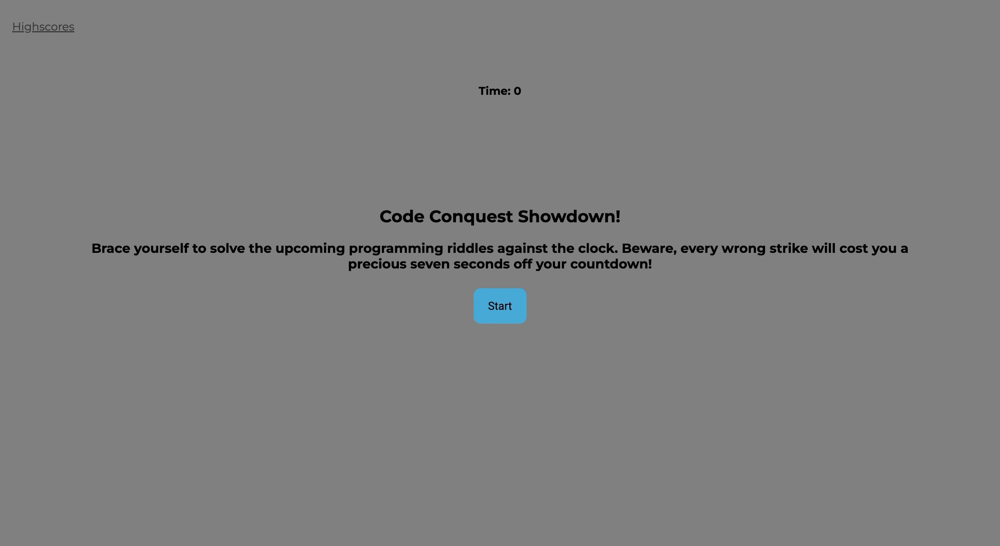

# Code Conquest Showdown!

## Description

### Overview

In your adventurous pursuit of becoming a proficient full-stack web developer, you will inevitably face the trial of coding assessments. These assessments could range from multiple-choice questions to interactive coding challenges, often thrown at you during the course of an interview.

To arm you with a competitive edge and offer you a taste of these challenges, "Code Conquest Showdown!" was created. This project is a time-sensitive, multiple-choice coding quiz, designed to help you evaluate your understanding of programming concepts in a fun and competitive manner.

Hosted right in your browser, "Code Conquest Showdown!" brings together dynamic HTML and CSS, combined with the power of JavaScript. It features an intuitive, polished, and responsive user interface, creating an engaging platform for testing your programming mettle.

### Features

As a participant in a coding boot camp, you get to undertake a timed quiz revolving around JavaScript fundamentals. Not only does the game give you a chance to assess your coding prowess, but it also lets you store high scores, giving you the means to measure your progress against your peers.

Here's what you can expect from "Code Conquest Showdown!":

1. Start the game with a click and kick-off a countdown timer while a question is posed.
2. Navigate through successive questions as you answer each one.
3. Be wary of incorrect answers as they will cost you valuable time.
4. The game concludes when all questions are answered, or the timer hits zero.
5. Upon game completion, you can save your score along with your initials.

## Screenshot

## Link to the Deployed Application

Link to Deployed Application: https://kojootchere.github.io/Code-Conquest-Showdown/
